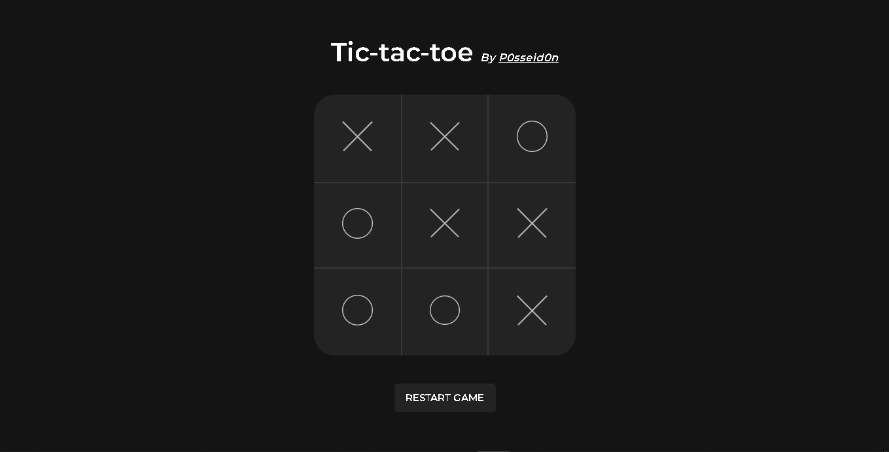

## Tic-tac-toe

Trabalho em progresso (Work in progress)

Projeto feito em Vuejs

### Recursos usados para aprendizado

-  Animações com vuejs (transition com animate.css)
-  Css Grid
-  Vuejs3
-  Vuex
